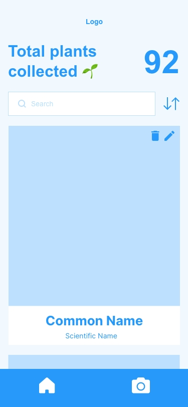
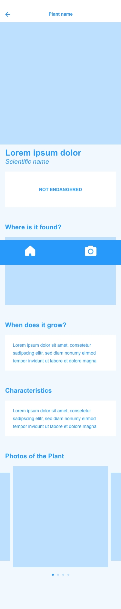
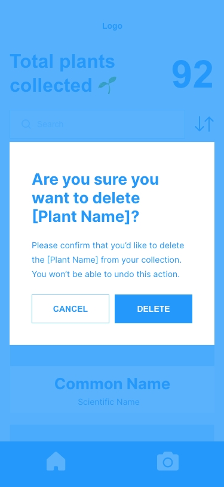
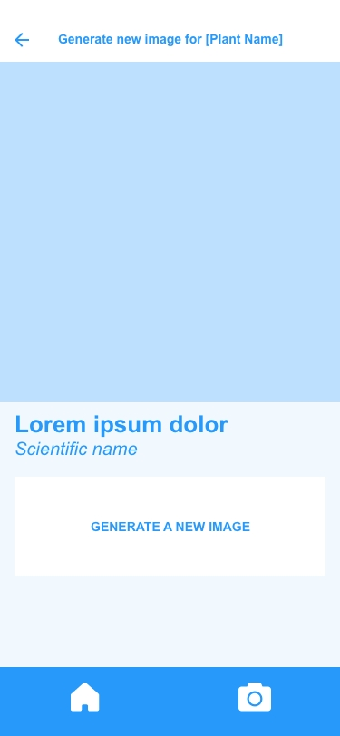
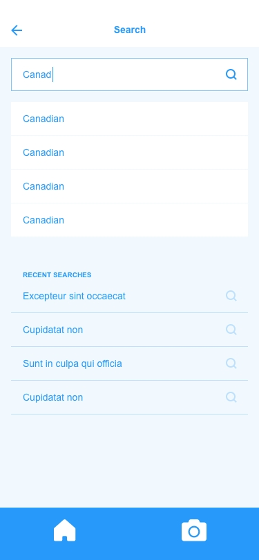
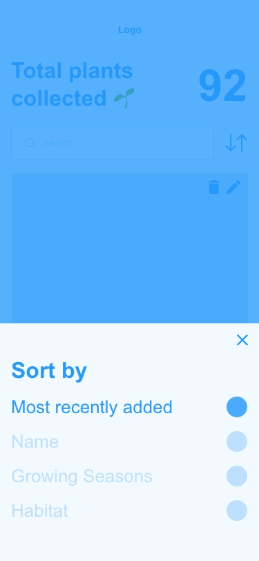
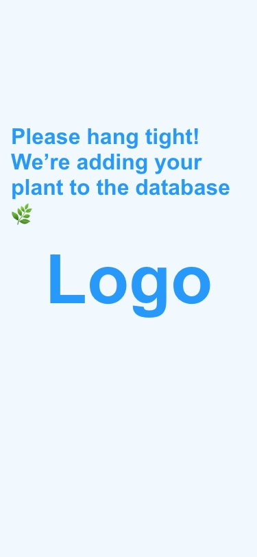
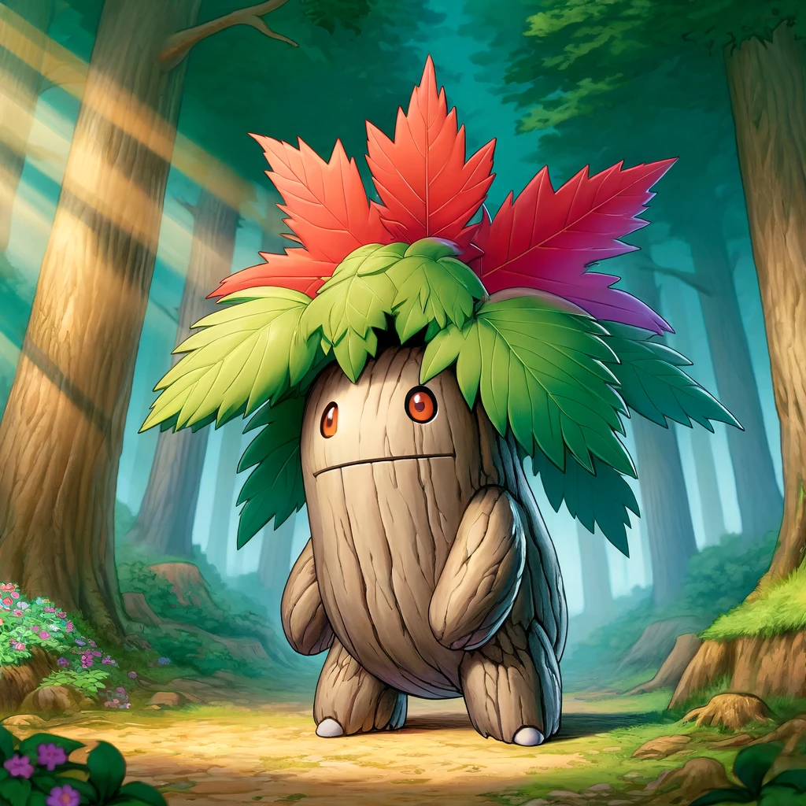
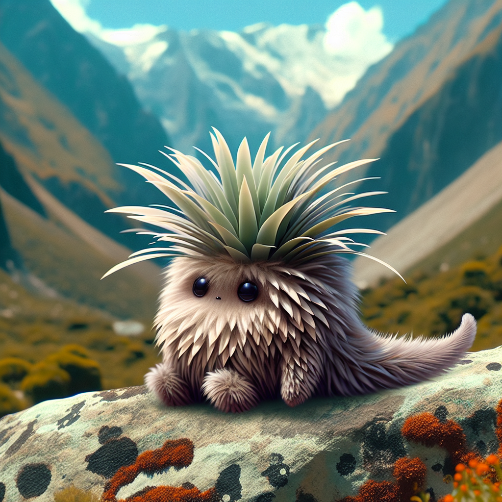

# Project Title

Kong (Keep our nature green)

## Overview

Kong helps foster the love for nature by gamifying plant identification. When user uploads or takes a photo of a plant they would like to identify, the OpenAI API will generate Pokémon-like illustration and information about the plant. The identified plant's illustration and information will be added to the user's collection.

### Problem

According to the World Economic Forum, almost 8 out of 10 children do not recognize common plants like an oak leaf or a bluebell. In a world where climate crisis is worse than ever, it is essential that we don't forget about the very basics: fostering a culture where we love and appreciate nature and have empathy towards the environment.

### User Profile

- Parents:
  - that want to help teach their children about plants in a fun and engaging way
- Children (12+):
  - that want to create and collect their own Pokémon-like creature illustrations
- Nature Lovers:
  - that want to keep track of the plants they've found

### Features

- As a user, I want to be able to identify the plant by taking or uploading a photo
- As a user, I want to be able to look at my collection of plants
- As a user, I want to be able to generate a new illustration of the plant if I am unhappy with the initial result (edit)
- As a user, I want to be able to delete a plant in my database

- As a user, I want to be able to sort my plants by different categories

- As a user, I want to be able to search for a specific plant in my collection

## Implementation

### Tech Stack

- React
- MySQL
- Express
- Client libraries:
  - react
  - react-router
  - react-webcam
  - axios
- Server libraries:
  - knex
  - express

### APIs

- OpenAI API for plant identification and image generation
- Wikimedia or MyPlantnet for plant photos

### Sitemap

- Home page (Collection)
- Sort plants in collection
- View details of specific plant
- Edit specific plant (generate new illustration)
- Delete specific plant
- Search for a specific plant
- Camera and photo album
- Loading screen

### Mockups

#### Home Page (Collections)



#### Plant Details Page (Collections/:id)



#### Delete Plant Modal (Collections/:id)



#### Edit Plant Page (Collections/:id)



#### Search Plant



#### Sort Plants



#### Camera Page


#### Loading Page



### Sample Illustrations





### Data


### Endpoints

**GET /collections**

- Get plant data

Parameters:

- image: User-uploaded image as a base64 file

Response:

```
[
    {
        "id": "f42c5fa5-f0f8-44e7-b343-7c99a0a8b02b",
        "common_name": "Sneezeweed",
        "scientific_name": "Helenium autumnale",
        "habitat":
        "Native to North America, typically found in moist meadows, prairies, and along roadsides.",
    season: "Blooms from late summer to fall (August to October)",
        "characteristics":
        "Grows up to 5 feet tall, has daisy-like flowers with a prominent central disc. The petals are typically yellow, orange, or red. Notably attracts butterflies and is used in late-season perennial borders.",
        "status": "Not Endangered",
        "image": "http://localhost:8080/images/sneezeweed.webp",
    },
    ...
]
```

**GET /collections/:id**

- Get plant by id

Parameters:

- id: Plant id as number

Response:

```
{
    "id": "f42c5fa5-f0f8-44e7-b343-7c99a0a8b02b",
    "common_name": "Sneezeweed",
    "scientific_name": "Helenium autumnale",
    "habitat":
    "Native to North America, typically found in moist meadows, prairies, and along roadsides.",
season: "Blooms from late summer to fall (August to October)",
    "characteristics":
    "Grows up to 5 feet tall, has daisy-like flowers with a prominent central disc. The petals are typically yellow, orange, or red. Notably attracts butterflies and is used in late-season perennial borders.",
    "status": "Not Endangered",
    "image": "http://localhost:8080/images/sneezeweed.webp",
}
```

**POST /camera**

- User can upload their plant photo, which will trigger a identification request to OpenAI API

Parameters:

- image: User-uploaded image as a base64 file
- prompt: Pre-written request to OpenAI API that would ask it to identify the plant, return the text of plant description, and generate an illustration

Response:

```
{
    "id": "f42c5fa5-f0f8-44e7-b343-7c99a0a8b02b",
    "common_name": "Sneezeweed",
    "scientific_name": "Helenium autumnale",
    "habitat":
    "Native to North America, typically found in moist meadows, prairies, and along roadsides.",
season: "Blooms from late summer to fall (August to October)",
    "characteristics":
    "Grows up to 5 feet tall, has daisy-like flowers with a prominent central disc. The petals are typically yellow, orange, or red. Notably attracts butterflies and is used in late-season perennial borders.",
    "status": "Not Endangered",
    "image": "http://localhost:8080/images/sneezeweed.webp",
}
```

**PUT /collections/:id**

- User can update their plant illustration

Parameters:

- id: Plant id
- prompt: Pre-written request to OpenAI API that would ask it to generate an illustration of the plant

Response:

```
{
    "id": "f42c5fa5-f0f8-44e7-b343-7c99a0a8b02b",
    "image": "http://localhost:8080/images/sneezeweed.webp",
}
```

**DELETE /collections/:id**

- User can delete a plant in their collection

Parameters:

- id: Plant id

Response:

```
{
    "message": "[Plant Name] has been deleted"
}
```

## Roadmap

- Create client

  - react project with routes and boilerplate pages

- Create server

  - express project with routing, with placeholder 200 responses

- Create database migrations

- Create seeds with 15 sample plant data and illustrations

- Deploy client and server projects so all commits will be reflected in production

- Feature: Upload or take photo of plant

  - Add form input to send photo to OpenAI API database
  - Create POST /camera endpoint

- Feature: List plants from the database collection

  - Implement list collections page
  - Create GET /collections endpoint

- Feature: View specific plant

  - Implement view plant details page
  - Create GET /collections/:id endpoint

- Feature: Delete specific plant

  - Create DELETE /collections/:id endpoint
  - Rerender GET /collections through useState

- Feature: Edit specific plant

  - Create PUT /collections/:id endpoint
  - Rerender GET /collections through useState

- Feature: Loading

  - Implement loading page during POST and PUT requests

- Feature: Sort plants in collection

  - Implement sorting functionality on the client side using parameters like habitat, season, and status
  - Rerender GET /collections through useState

- Feature: Search for plants in collection

  - Implement search functionality on the client side
  - Rerender GET /collections through useState

- Bug fixes

- DEMO DAY

## Nice-to-haves

- Integrate Google Maps
  - View where the plant's usual habitat is around the world
- Integrate Geotag
  - View where the plant was added to the collection
  - View plants that are nearby that can be added to the collection
- Feature: "Featured Plants"
  - View plants that are nearby that can be added to the collection
