# Kong (Keep our nature green)

Created by Julia (Seo Hyeon) Kim | Released on June 2024 | Version 1.0

Visit the live app here 👉 https://kong-app.netlify.app

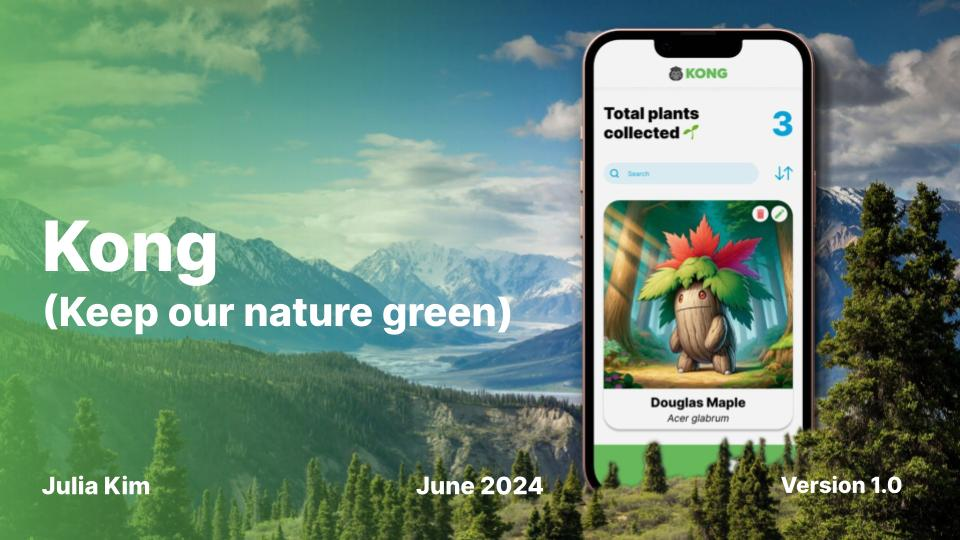

## What is Kong? 🦍

<b>Kong</b> helps foster the love for nature by gamifying plant identification. When user uploads or takes a photo of a plant, MyPlantnet identifies it, OpenAI API provides information about the plant, and StabilityAI API generates a Pokémon-like illustration. The identified plant's illustration and information will be added to the user's collection.

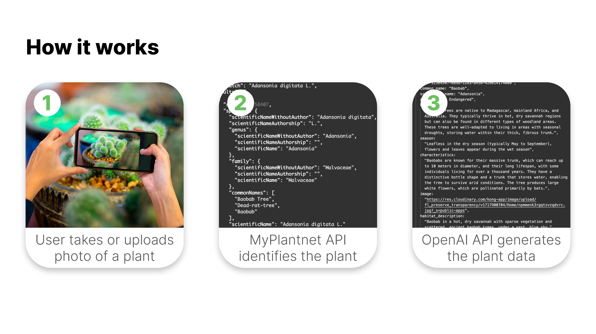
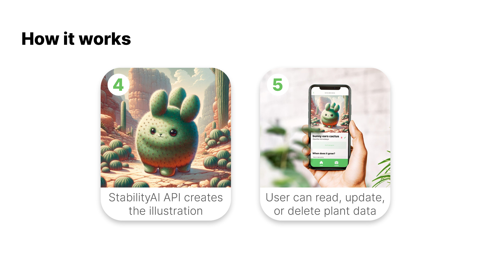

## Why is Kong necessary?

According to the World Economic Forum, almost 8 out of 10 children do not recognize common plants like an oak leaf or a bluebell. In a world where climate crisis is worse than ever, it is essential that we don't forget about the very basics: fostering a culture where we love and appreciate nature and have empathy towards the environment.

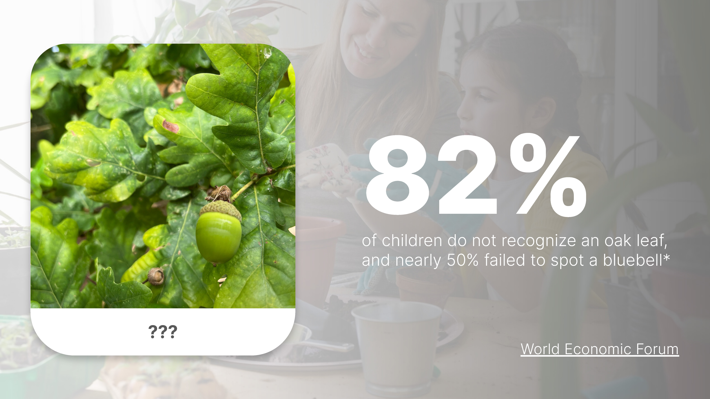

## Screenshots

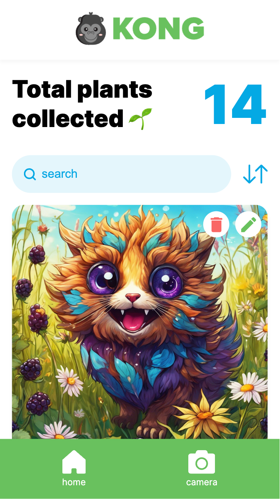

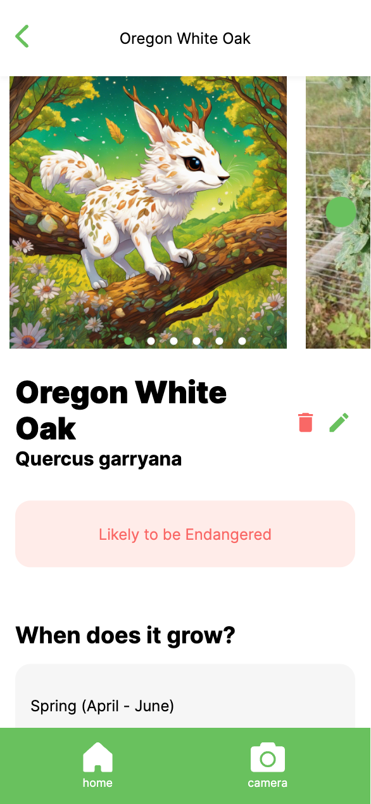

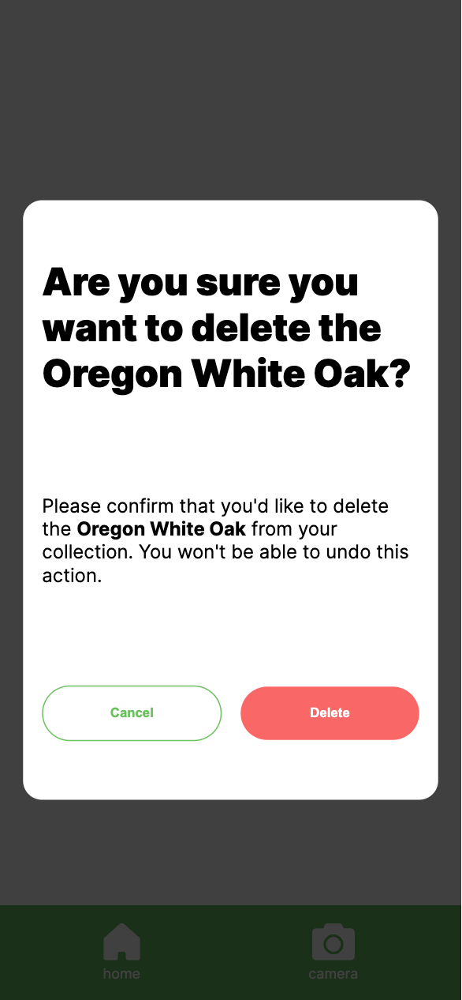

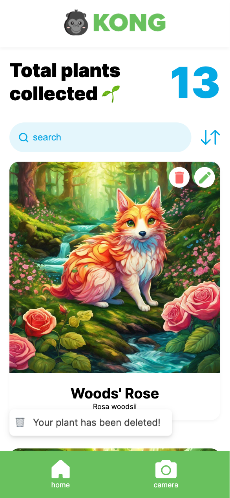

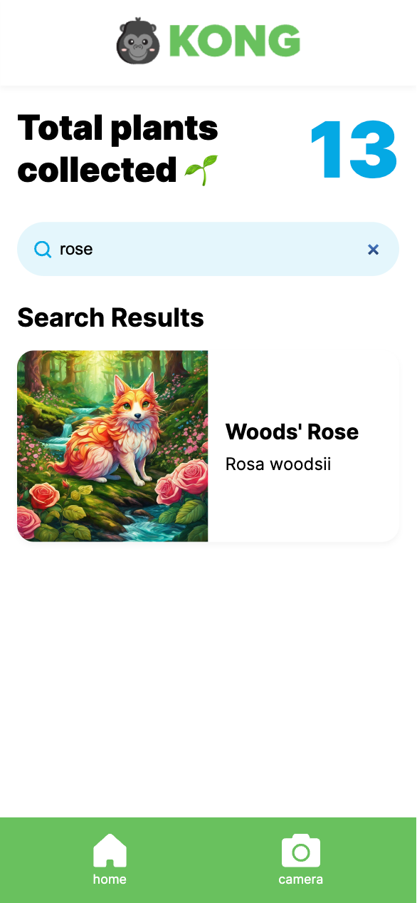

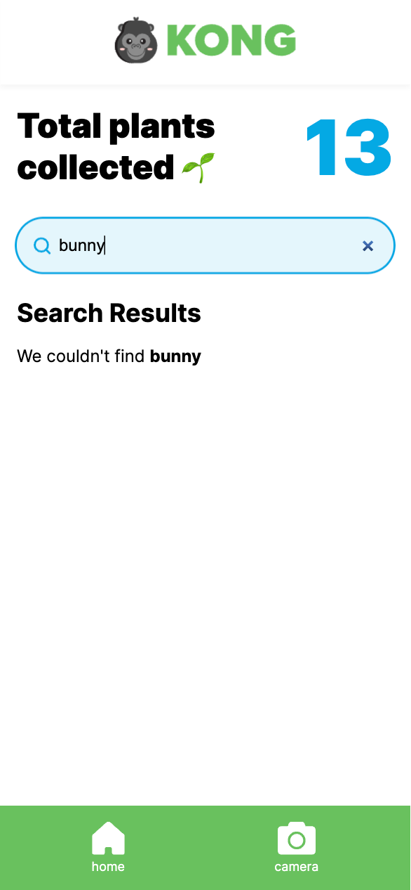

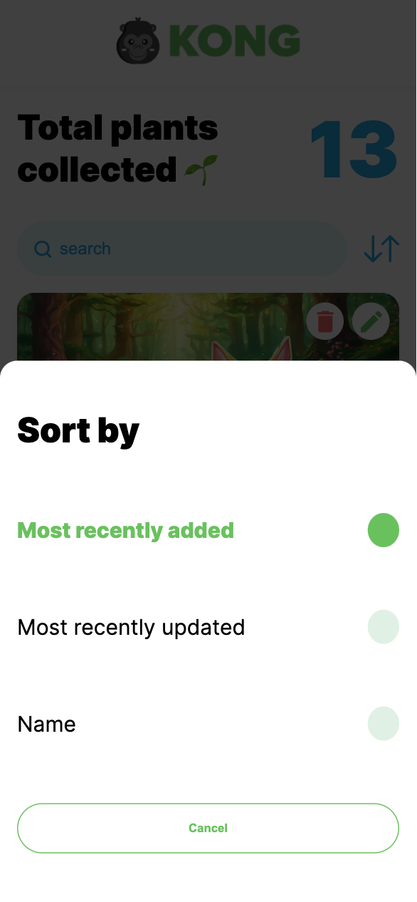

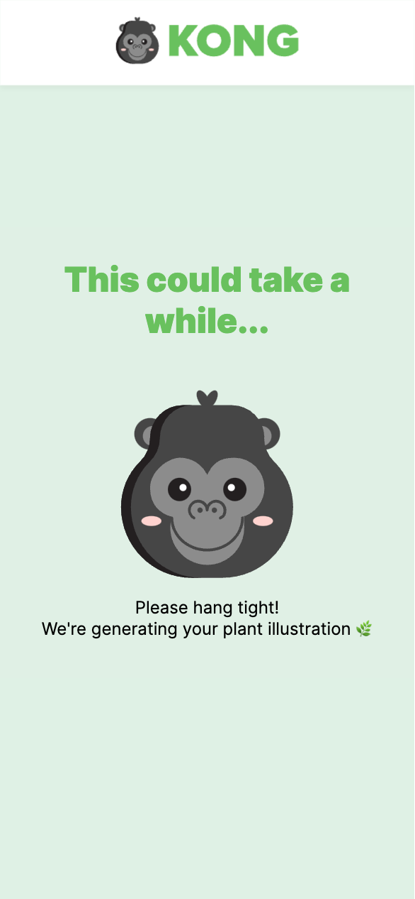

## The Details

### Features

- Users can identify the plant by taking or uploading a photo
- Users can look at their collection of plants
- Users can generate a new illustration of the plant if they are unhappy with the initial result
- Users can delete plants in their database
- Users can sort plants by different categories
- Users can search for a specific plant in their collection

### Tech Stack

- React
- MySQL
- Express
- Client libraries:
  - react
  - react-router
  - react-webcam
  - react-hot-toast
  - react-responsive-carousel
  - axios
- Server libraries:
  - knex
  - express

### APIs

- <b>MyPlantnet</b> for plant identification and related plant photos
- <b>OpenAI API</b> for generation of plant information
- <b>StabilityAI API</b> for generation of illustration

## Next Steps

- User Auth
- Incorporate Comfy UI for fine-tuned image generation
- Tutorial on initial start to show how app works
- Ability to send multiple photos to API for better identification
- Integrate Google Maps
  - View where the plant's usual habitat is around the world
- Integrate Geotag
  - View where the plant was added to the collection
  - View plants that are nearby that can be added to the collection
- Feature: "Featured Plants"
  - View plants that are nearby that can be added to the collection
- Feature: "Add Friends"
  - Allow users to compare stats of collected plants
